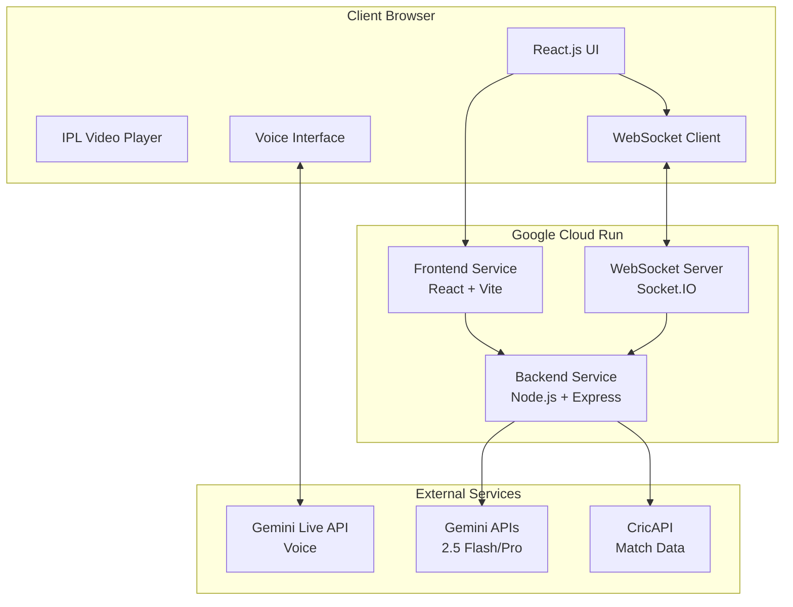
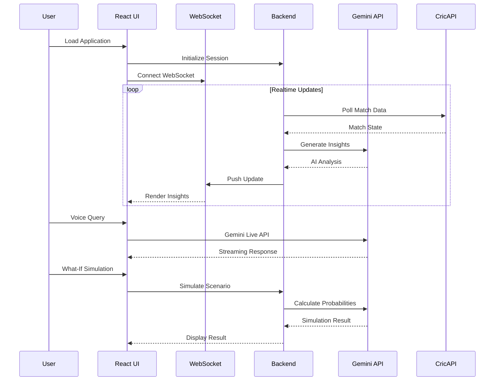

# Design Document: IPL AI Split-Screen Assistant MVP

## Overview

The IPL AI Split-Screen Assistant is a realtime AI-powered companion application that enhances live IPL cricket viewing. The system provides a split-screen interface where the left side displays the live IPL video stream, and the right side hosts an intelligent AI assistant panel. The assistant delivers realtime insights, win probability calculations, tactical analysis, voice-driven interactions, and what-if scenario simulations. Built with React.js, TypeScript, Stitch MCP for UI generation, Gemini APIs for AI reasoning, and deployed on Google Cloud Run, the MVP prioritizes low-latency responsiveness and immersive UX while maintaining architectural simplicity.

## Architecture



### System Flow



## Components and Interfaces

### Frontend Components

#### SplitScreenLayout

**Purpose**: Manages the responsive split-screen layout with resizable panels

**Interface**:
```typescript
interface SplitScreenLayoutProps {
  videoSrc: string;
  onResize?: (leftWidth: number, rightWidth: number) => void;
  defaultSplit?: number; // percentage for left panel (default: 60)
  minLeftWidth?: number;
  minRightWidth?: number;
}

interface SplitScreenLayout {
  render(): JSX.Element;
  toggleFullscreen(panel: 'left' | 'right' | 'both'): void;
  setCompactMode(enabled: boolean): void;
  resetLayout(): void;
}
```

**Responsibilities**:
- Render split-screen container with resizable divider
- Handle drag-to-resize interactions
- Manage fullscreen transitions
- Persist layout preferences
- Respond to viewport changes

#### AIAssistantPanel

**Purpose**: Container for all AI-powered features and realtime insights

**Interface**:
```typescript
interface AIAssistantPanelProps {
  matchId: string;
  onVoiceQuery?: (query: string) => void;
  theme?: 'dark' | 'light';
}

interface AIAssistantPanel {
  render(): JSX.Element;
  updateInsights(insights: AIInsight[]): void;
  showSimulation(result: SimulationResult): void;
  activateVoiceMode(): void;
}
```

**Responsibilities**:
- Display realtime match insights
- Render win probability meter
- Host voice assistant interface
- Show what-if simulation results
- Manage panel state and animations

#### RealtimeInsightsCard

**Purpose**: Displays AI-generated tactical insights with animations

**Interface**:
```typescript
interface AIInsight {
  id: string;
  type: 'tactical' | 'momentum' | 'prediction' | 'alert';
  title: string;
  content: string;
  confidence: number;
  timestamp: number;
  metadata?: Record<string, any>;
}

interface RealtimeInsightsCardProps {
  insights: AIInsight[];
  maxVisible?: number;
  autoScroll?: boolean;
}
```

**Responsibilities**:
- Render insight cards with glassmorphism styling
- Animate new insights entering
- Auto-dismiss stale insights
- Handle user interactions (expand, dismiss)

#### VoiceAssistantOrb

**Purpose**: Visual interface for voice interactions with Gemini Live API

**Interface**:
```typescript
interface VoiceAssistantOrbProps {
  isListening: boolean;
  isSpeaking: boolean;
  onActivate: () => void;
  onDeactivate: () => void;
}

interface VoiceAssistantOrb {
  render(): JSX.Element;
  startListening(): void;
  stopListening(): void;
  showTranscript(text: string): void;
  animateSpeaking(): void;
}
```

**Responsibilities**:
- Render animated orb with pulsing effects
- Display listening/speaking states
- Show live transcription
- Handle voice activation/deactivation
- Provide visual feedback for audio levels

#### WhatIfSimulator

**Purpose**: Interactive panel for scenario simulation

**Interface**:
```typescript
interface SimulationScenario {
  type: 'wicket' | 'over_outcome' | 'batting_survival' | 'bowling_change';
  parameters: Record<string, any>;
}

interface SimulationResult {
  scenario: SimulationScenario;
  winProbability: {
    team1: number;
    team2: number;
  };
  projectedScore: number;
  momentumShift: number;
  tacticalImpact: string;
  confidence: number;
}

interface WhatIfSimulatorProps {
  currentMatch: MatchState;
  onSimulate: (scenario: SimulationScenario) => Promise<SimulationResult>;
}
```

**Responsibilities**:
- Render scenario selection interface
- Collect simulation parameters
- Display simulation results with visualizations
- Compare current vs simulated states
- Animate probability changes

#### WinProbabilityMeter

**Purpose**: Visual representation of win probability with realtime updates

**Interface**:
```typescript
interface WinProbability {
  team1: number;
  team2: number;
  lastUpdated: number;
  trend: 'increasing' | 'decreasing' | 'stable';
}

interface WinProbabilityMeterProps {
  probability: WinProbability;
  team1Name: string;
  team2Name: string;
  animated?: boolean;
}
```

**Responsibilities**:
- Render horizontal probability bar
- Animate probability changes
- Show trend indicators
- Display team names and percentages
- Update smoothly without jarring transitions

### Backend Services

#### MatchDataService

**Purpose**: Fetches and normalizes cricket match data from CricAPI

**Interface**:
```typescript
interface MatchState {
  matchId: string;
  status: 'live' | 'completed' | 'upcoming';
  teams: {
    team1: TeamInfo;
    team2: TeamInfo;
  };
  score: ScoreInfo;
  currentBatter: PlayerInfo;
  currentBowler: PlayerInfo;
  recentBalls: Ball[];
  overs: number;
  wickets: number;
  requiredRunRate?: number;
  timestamp: number;
}

interface MatchDataService {
  getLiveMatch(matchId: string): Promise<MatchState>;
  subscribeToMatch(matchId: string, callback: (state: MatchState) => void): void;
  unsubscribeFromMatch(matchId: string): void;
  getPlayerStats(playerId: string): Promise<PlayerStats>;
}
```

**Responsibilities**:
- Poll CricAPI for match updates
- Normalize API responses to internal format
- Cache recent match states
- Detect significant events (wickets, boundaries, milestones)
- Manage API rate limits

#### GeminiInsightsService

**Purpose**: Generates AI insights using Gemini 2.5 Flash/Pro

**Interface**:
```typescript
interface InsightRequest {
  matchState: MatchState;
  context: string[];
  insightType: 'tactical' | 'momentum' | 'prediction';
  maxTokens?: number;
}

interface GeminiInsightsService {
  generateInsight(request: InsightRequest): Promise<AIInsight>;
  generateBatchInsights(requests: InsightRequest[]): Promise<AIInsight[]>;
  streamInsight(request: InsightRequest): AsyncIterator<string>;
  calculateWinProbability(matchState: MatchState): Promise<WinProbability>;
}
```

**Responsibilities**:
- Interface with Gemini 2.5 Flash for low-latency insights
- Use Gemini 2.5 Pro for complex tactical reasoning
- Construct prompts with match context
- Parse and structure AI responses
- Handle streaming responses
- Implement retry logic and error handling

#### VoiceAssistantService

**Purpose**: Manages voice interactions via Gemini Live API

**Interface**:
```typescript
interface VoiceQuery {
  audioData: ArrayBuffer;
  matchContext: MatchState;
  conversationHistory: Message[];
}

interface VoiceResponse {
  audioData: ArrayBuffer;
  transcript: string;
  intent: string;
  confidence: number;
}

interface VoiceAssistantService {
  processVoiceQuery(query: VoiceQuery): AsyncIterator<VoiceResponse>;
  startConversation(matchId: string): string; // returns conversationId
  endConversation(conversationId: string): void;
  handleInterruption(conversationId: string): void;
}
```

**Responsibilities**:
- Stream audio to Gemini Live API
- Receive streaming audio responses
- Maintain conversation context
- Handle interruptions gracefully
- Manage conversation state

#### SimulationEngine

**Purpose**: Calculates what-if scenarios using Gemini reasoning

**Interface**:
```typescript
interface SimulationEngine {
  simulateScenario(
    currentState: MatchState,
    scenario: SimulationScenario
  ): Promise<SimulationResult>;
  
  compareScenarios(
    currentState: MatchState,
    scenarios: SimulationScenario[]
  ): Promise<SimulationComparison>;
  
  explainSimulation(result: SimulationResult): Promise<string>;
}
```

**Responsibilities**:
- Apply scenario parameters to current match state
- Use Gemini Pro for probability calculations
- Generate tactical impact analysis
- Compare multiple scenarios
- Provide natural language explanations

#### WebSocketManager

**Purpose**: Manages realtime bidirectional communication

**Interface**:
```typescript
interface WebSocketManager {
  initialize(server: Server): void;
  broadcastMatchUpdate(matchId: string, update: MatchState): void;
  broadcastInsight(matchId: string, insight: AIInsight): void;
  sendToClient(clientId: string, event: string, data: any): void;
  onClientConnect(callback: (clientId: string) => void): void;
  onClientDisconnect(callback: (clientId: string) => void): void;
}
```

**Responsibilities**:
- Manage Socket.IO connections
- Handle client subscriptions to matches
- Broadcast updates to subscribed clients
- Handle reconnection logic
- Manage connection pools

## Data Models

### MatchState

```typescript
interface MatchState {
  matchId: string;
  status: 'live' | 'completed' | 'upcoming';
  teams: {
    team1: TeamInfo;
    team2: TeamInfo;
  };
  score: ScoreInfo;
  currentBatter: PlayerInfo;
  currentBowler: PlayerInfo;
  recentBalls: Ball[];
  overs: number;
  wickets: number;
  requiredRunRate?: number;
  timestamp: number;
}

interface TeamInfo {
  id: string;
  name: string;
  shortName: string;
  score: number;
  wickets: number;
  overs: number;
}

interface ScoreInfo {
  runs: number;
  wickets: number;
  overs: number;
  runRate: number;
  target?: number;
  requiredRunRate?: number;
}

interface PlayerInfo {
  id: string;
  name: string;
  role: 'batter' | 'bowler' | 'allrounder' | 'wicketkeeper';
  currentStats: {
    runs?: number;
    balls?: number;
    fours?: number;
    sixes?: number;
    wickets?: number;
    economy?: number;
  };
}

interface Ball {
  over: number;
  ball: number;
  runs: number;
  isWicket: boolean;
  isExtra: boolean;
  extraType?: 'wide' | 'noball' | 'bye' | 'legbye';
  batter: string;
  bowler: string;
}
```

**Validation Rules**:
- matchId must be non-empty string
- status must be one of the defined enum values
- overs must be non-negative number
- wickets must be between 0 and 10
- timestamp must be valid Unix timestamp
- requiredRunRate only present when chasing

### AIInsight

```typescript
interface AIInsight {
  id: string;
  type: 'tactical' | 'momentum' | 'prediction' | 'alert';
  title: string;
  content: string;
  confidence: number; // 0-1
  timestamp: number;
  metadata?: {
    relatedPlayers?: string[];
    triggerEvent?: string;
    priority?: 'low' | 'medium' | 'high';
  };
}
```

**Validation Rules**:
- id must be unique UUID
- type must be one of defined values
- title max length 100 characters
- content max length 500 characters
- confidence must be between 0 and 1
- timestamp must be valid Unix timestamp

### SimulationScenario

```typescript
interface SimulationScenario {
  type: 'wicket' | 'over_outcome' | 'batting_survival' | 'bowling_change';
  parameters: WicketParams | OverOutcomeParams | SurvivalParams | BowlingChangeParams;
}

interface WicketParams {
  batterOut: string;
  newBatter: string;
  overRemaining: number;
}

interface OverOutcomeParams {
  runs: number;
  wickets: number;
  bowler: string;
}

interface SurvivalParams {
  batter: string;
  ballsToSurvive: number;
}

interface BowlingChangeParams {
  newBowler: string;
  oversRemaining: number;
}
```

**Validation Rules**:
- type must match one of the defined scenario types
- parameters must match the corresponding params interface
- all player references must be valid player IDs
- numeric values must be within realistic cricket bounds

### WebSocketMessage

```typescript
interface WebSocketMessage {
  event: 'match_update' | 'insight' | 'simulation_result' | 'voice_response';
  matchId: string;
  timestamp: number;
  data: MatchState | AIInsight | SimulationResult | VoiceResponse;
}
```

**Validation Rules**:
- event must be one of defined types
- matchId must be non-empty string
- timestamp must be valid Unix timestamp
- data must match the type corresponding to event

## Main Algorithm/Workflow

### Realtime Insights Generation Pipeline

```mermaid
sequenceDiagram
    participant Poller as Match Poller
    participant CricAPI
    participant Detector as Event Detector
    participant Gemini as Gemini Service
    participant WS as WebSocket
    participant Client
    
    loop Every 5 seconds
        Poller->>CricAPI: GET /match/{id}
        CricAPI-->>Poller: Match Data
        Poller->>Detector: Analyze State Change
        
        alt Significant Event Detected
            Detector->>Gemini: Generate Insight
            Gemini-->>Detector: AI Insight
            Detector->>WS: Broadcast Insight
            WS-->>Client: Push Update
        end
        
        Poller->>WS: Broadcast Match State
        WS-->>Client: Push Update
    end
