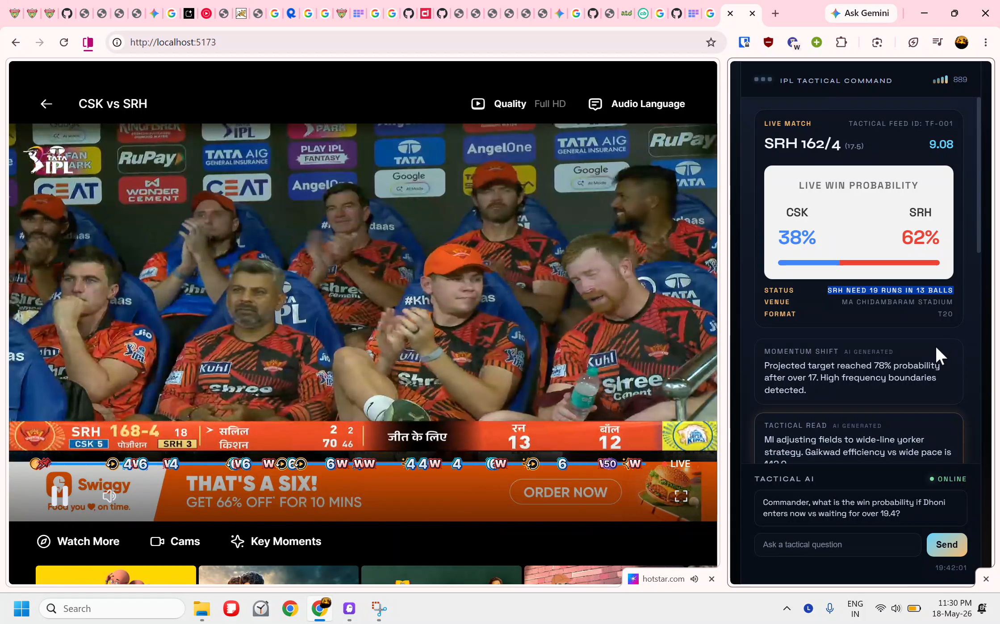
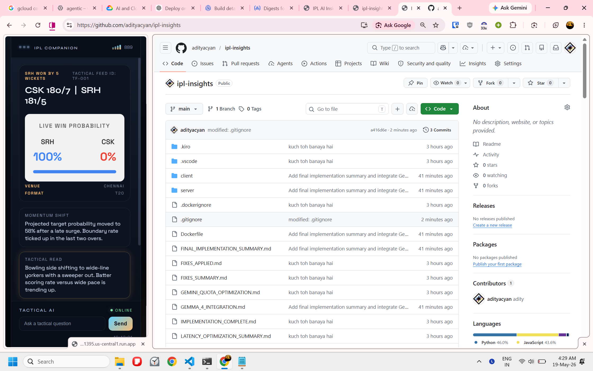
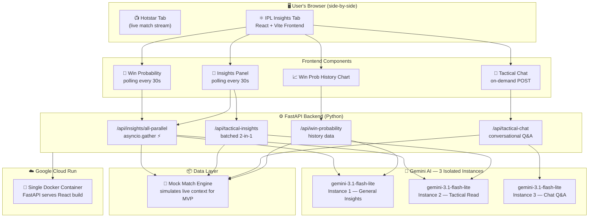
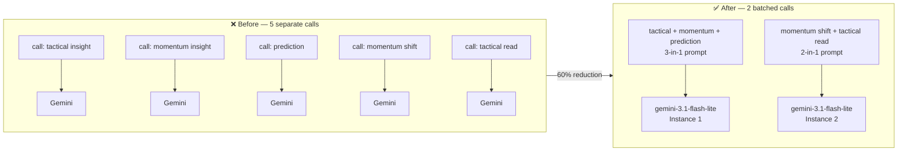
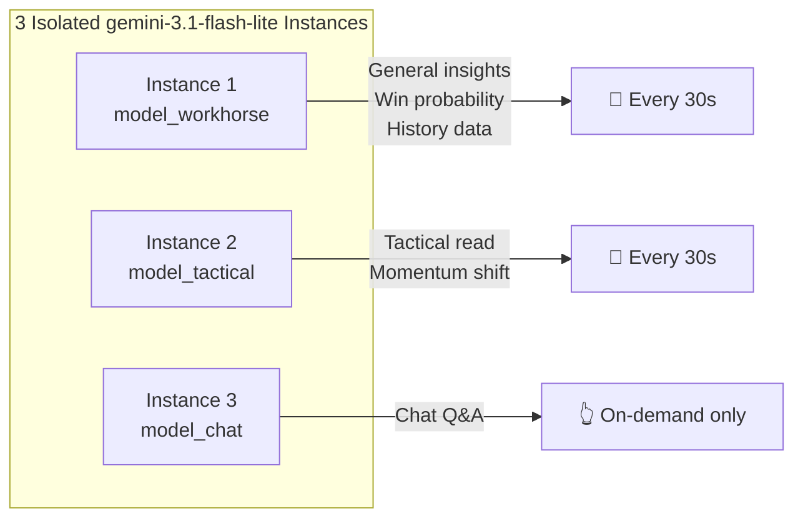
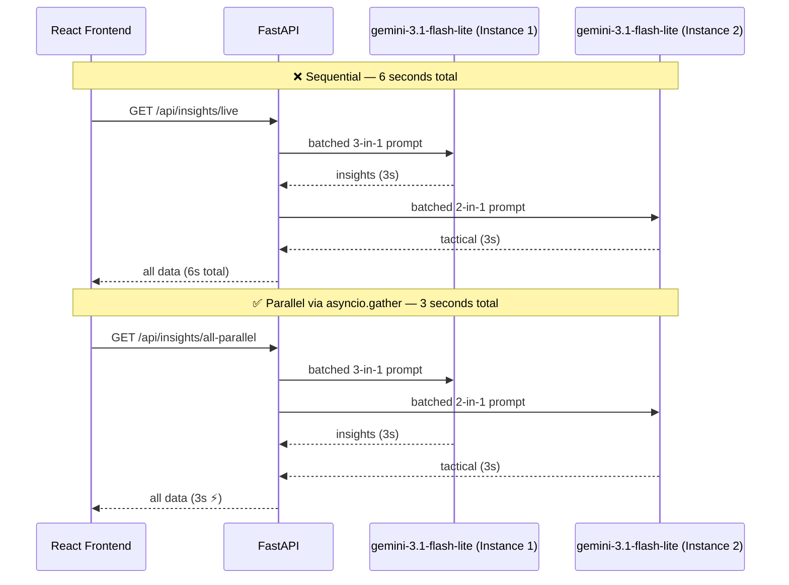

# 🏏 IPL Insights — AI-Powered Second-Screen Companion

---

> # 🔴 WORKS BEST DURING A LIVE IPL MATCH
> ### Open this alongside your Hotstar tab when a match is in progress — that's when the AI insights, win probability, momentum analysis, and tactical reads are all firing in real time. Outside of a live match, you'll see less stats (as there is no way to show who is currently batting and who is balling) and mock/ previous match  data.

---

> **The idea is simple:** Open this app side-by-side with your Hotstar tab. Watch the match. Get stats, AI insights, and win probabilities on your fingertips — without ever switching tabs.

**[🔴 Live Demo on Google Cloud Run](https://ipl-insight-123853821395.us-central1.run.app)**

---

## 🎬 The Experience

Most cricket fans watching on Hotstar or JioCinema have to constantly switch between the stream and a stats site to understand what's happening. **IPL Insights kills that friction.**

Open the app on the right half of your screen, keep Hotstar on the left — and suddenly you have your own personal cricket analyst whispering insights in real time:

- **"SHR needs 19 runs in 13 balls."**
- **"Momentum shift — projected target probability hit 78% after over 17."**
- **"MI adjusting to wide-line yorker strategy. Gaikwad efficiency vs wide pace is..."**

That's not commentary. That's **Gemini AI reading the match for you.**

---

## 📸 Screenshots

### 🔴 During a Live Match — Side-by-Side with Hotstar

*This is exactly how it's meant to be used. Hotstar on the left, IPL Insights on the right.*



### ✅ After the Match — Standalone Post-Match View

*Clean post-match summary with final win probability, tactical read, and AI insights.*



---

## ✨ Features

| Feature | What it does |
|---|---|
| 🎯 **Live Win Probability** | Real-time CSK vs SHR % calculated by Gemini every 30s |
| 📊 **Momentum Shift Analysis** | AI detects scoring surges, wicket clusters, boundary patterns |
| 🧠 **Tactical Read** | Field placement analysis, bowling strategy, batter matchups |
| 💬 **Tactical Chat** | Ask anything — "Can CSK still win?" — and get an AI answer |
| 📈 **Win Probability History** | Chart of how probabilities shifted over the innings |
| 🏆 **Playoff Predictor** | Toggle hypothetical outcomes, see playoff picture shift live |
| 🎖️ **Milestone Tracker** | Tracks how many runs/wickets till Orange Cap / Purple Cap |

---

## 🏗️ Architecture

> **Honest note:** This was built in ~4 hours as a hackathon MVP. There are rough edges — polling instead of true WebSockets, mock data fallbacks, some hardcoded match IDs. But it *works*, and the core experience is real. Here's what's under the hood:

### System Architecture



> ⚠️ **Known limitations (4-hour build):** HTTP polling not true WebSockets · mock match data (no live CricAPI yet) · insights may repeat on fast polling · free Gemini tier quota fills up quickly

---

## 💰 How We Save on API Quota

The free Gemini tier is brutal — 5 separate AI calls every 30s would exhaust daily quota in minutes. Here's the 3-layer strategy that keeps it alive:

### Layer 1 — Prompt Batching (60% fewer calls)

Instead of 1 call per insight, multiple questions are combined into one prompt and the response is parsed:



### Layer 2 — Model Isolation (no quota collisions)

Each feature class uses a **dedicated model instance** so one noisy feature can't starve the others:



### Layer 3 — Parallel Execution (50% faster, same quota)



### Net Result

| Metric | Naïve Approach | This App | Saving |
|---|---|---|---|
| API calls per refresh cycle | 5 | 2 | **60% fewer** |
| Response latency | ~6s | ~3s | **2× faster** |
| Quota collisions | Yes (shared) | No (isolated) | **0 collisions** |
| Chat impact on insights | Starves quota | Independent | **Fully isolated** |

---

## 🚀 Running Locally

**1. Install dependencies**
```bash
npm run install-all
```

**2. Set your Gemini API key**
```bash
cp server/.env.example server/.env
# Edit server/.env:
# GEMINI_API_KEY=your_key_here
```
Get a free key at [aistudio.google.com](https://aistudio.google.com/app/apikey)

**3. Build frontend + start server**
```bash
cd client && npm run build
cd ..
Copy-Item -Path "client\dist\*" -Destination "server\public\" -Recurse -Force
python server\app.py
```

Visit `http://localhost:8080` — then **snap this window to the right half of your screen** and open Hotstar on the left. That's the whole point.

---

## ☁️ Deploy to Cloud Run

```bash
gcloud run deploy ipl-agent \
  --source . \
  --region us-central1 \
  --allow-unauthenticated
```

---

## 💡 Why This Matters

Watching cricket is better when you understand what you're watching. The difference between a casual viewer and a knowledgeable fan is context — and that's exactly what this app provides in real time.

**Win probability at 62%? The AI just told you why.**
**SRH needs 19 off 13? The tactical read already flagged the bowling strategy.**
**Wondering if MI can still make playoffs? Toggle it and see the table shift.**

No more switching tabs. No more missing a wicket while reading Cricbuzz. Just watch — and have the stats on your fingertips.

---

## 🛠 Tech Stack

- **Frontend:** React + Vite + Vanilla CSS (glassmorphism dark mode)
- **Backend:** FastAPI (Python) + asyncio parallel execution
- **AI:** Google Gemini 1.5 Flash, 2.0 Flash Lite (multi-model quota isolation)
- **Deployment:** Docker + Google Cloud Run
- **Data:** Mock match engine (CricAPI integration planned)

---

*Built at a hackathon in ~4 hours. Rough around the edges, but the experience is real.*
